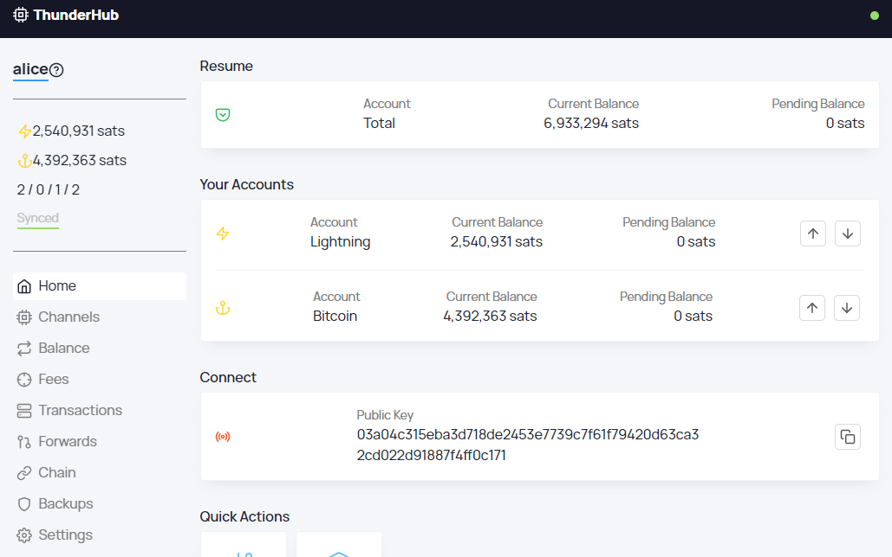

# **ThunderHub - Lightning Node Manager**


[](https://github.com/DAVFoundation/captain-n3m0/blob/master/LICENSE) [](https://snyk.io/test/github/apotdevin/thunderhub) [](https://snyk.io/test/github/apotdevin/thunderhub) [](https://lerna.js.org/)

## Table Of Contents

- [Introduction](#introduction)
- [Features](#features)
- [Installation](#installation)
- [Development](#development)

## Introduction

ThunderHub is an **open-source** LND node manager where you can manage and monitor your node on any device or browser. It allows you to take control of the lightning network with a simple and intuitive UX and the most up-to-date tech stack.

### Tech Stack

The repository consists of two packages (client and server) and is maintained with LernaJS and Yarn Workspaces.

#### Client

[](https://snyk.io/test/github/apotdevin/thunderhub)

- ReactJS
- Typescript
- Styled-Components
- Apollo

#### Server

[](https://snyk.io/test/github/apotdevin/thunderhub)

- Apollo-Server
- GraphQL
- Ln-Service

## Features

### Monitoring

- Overview of current and pending balance for the Lightning and Bitcoin wallets.
- URI strings for the node (Onion public uri also if available)
- Invoice and Payment graph.
- Liquidity report with total remote and local lightning balance.
- Forwarded payments graph and the routes used for these payments.
- Complete network info.
- View open/pending/closed channels and how balanced they are.
- View channel base and rate fees.
- View all transactions.
- View all forwarded payments.
- View all chain transactions.
- View all unspent UTXOS.

### Management

- Send and Receive Lightning payments.
- Send and Receive Bitcoin payments.
- Decode lightning payment requests.
- Open and close channels.
- Balance your channels through circular payments. ([Check out the Tutorial](https://medium.com/coinmonks/lightning-network-channel-balancing-with-thunderhub-972b41bf9243))
- Update your all your channels fees or individual ones.
- Backup, verify and recover all your channels.
- Sign and verify messages.

### Visual

- Responsive UI for any device. Mobile, Tablet or Desktop.
- Light and Dark mode.
- Check values in Bitcoin, Satoshis or Fiat.

### Accounts

- Many ways to connect to your node: **HEX/Base64 strings**, **LNDConnect Url**, **BTCPayServer Info** or **QR codes**.
- Have view-only and/or admin accounts.
- Manage however many accounts your browser storage can hold.
- Quickly sync your accounts between devices. No need to copy/paste macaroons and certificates.

### Deployment

- Docker images for easier deployment (WIP)

### Future Features

- Loop In and Out to provide liquidity or remove it from your channels.
- Integration with HodlHodl
- Storefront interface

## Installation

To run ThunderHub you first need to clone this repository.

```javascript
git clone https://github.com/apotdevin/thunderhub.git
```

### **Requirements**

- Node installed
- Yarn installed

After cloning the repository run `yarn` to get all the necessary modules installed. Yarn workspaces will handle installing modules for both the client and the server.

### **ThunderHub - Server**

To be able to use the HodlHodl integration create a `.env` file in the `/server` folder with `HODL_KEY='[YOUR API KEY]'` and replace `[YOUR API KEY]` with the one that HodlHodl provides you.

#### To get the server running use the following commands

```javascript
yarn server:prod
yarn server:run
```

If the server starts succesfully, you should see `info [server.js]: Server ready at http://localhost:3001/` in the terminal

### **ThunderHub - Client**

#### To get the React frontend running use the following commands

##### This must be done in the `/client` folder

```javascript
yarn start
```

If the frontend starts succesfully, you should see `Compiled successfully! You can now view app in the browser.` in the terminal and a browser window should have opened in your browser.

## Development

If you want to develop on ThunderHub and want hot reloading when you do changes, use the following commands:

### ThunderHub - Server

```javascript
yarn server:dev
```

### ThunderHub - Client

Running the commands `yarn start` in the `client` folder works for development.

#### Storybook

You can also get storybook running for quicker component development.

```javascript
yarn storybook
```
